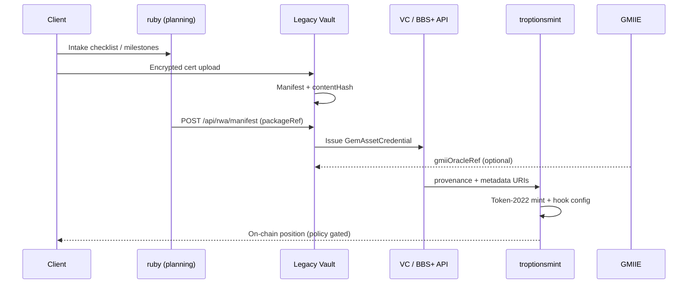

# Full Stack Integration Map

End-to-end data flow for Allure Ruby + Siam Emerald RWA tokenization.

## Repository boundaries

| System | Owns | Does not own |
|--------|------|----------------|
| **ruby** | Client portal, planning docs, PDF templates, public indexes | Private keys, encrypted PDFs |
| **Legacy** | Vault encryption, IPFS, VC issuance, BBS+ verify, audit chain | Mint authority |
| **troptionsmint** | SPL mint, on-chain metadata, authority revocation | Vault encryption |
| **GMIIE** | Comp snapshots, oracle refs | Legal appraisal |
| **x402** | Metered export / API settlement | Core vault encryption |
| **Agent Mailor** | Agent workflow notifications (stub) | Legal opinions |

## API touchpoints (summary)

See [../docs/API_INTEGRATION.md](../docs/API_INTEGRATION.md) for endpoint tables and Legacy PR links.

| Direction | Call |
|-----------|------|
| ruby → Legacy | `POST /api/rwa/manifest` |
| troptionsmint → Legacy | `GET /api/rwa/provenance/{tokenId}` |
| Client → Legacy | `POST /api/vc/issue/gem-asset`, `POST /api/vc/present/bbs` (when deployed) |
| Agent → Vault | x402-gated exports per [Legacy X402 doc](https://github.com/FTHTrading/Legacy/blob/main/docs/X402_INTEGRATION.md) |

## Brick roadmap

| Brick | Deliverable |
|-------|-------------|
| **#1 (this PR)** | Client portal, architecture docs, PDF pipeline stubs |
| **#2** | Live VC issuance + contact form → intake API |
| **#3** | Vercel deploy + branded PDF CSS |
| **#4** | Mainnet mint with bound appraisal refs |
