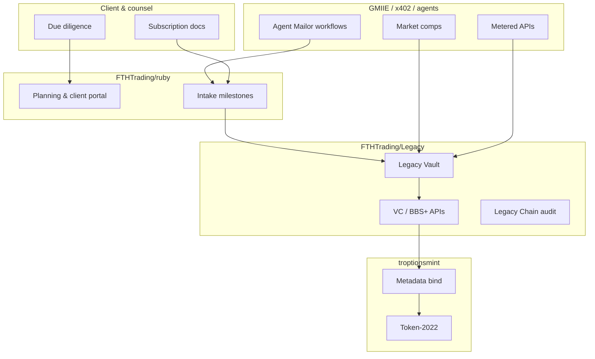

# System Overview — Allure Ruby RWA

High-level view of the institutional gem RWA program and its sovereign infrastructure partners.

## Program scope

| Asset | Role |
|-------|------|
| **Allure Ruby** | 54.00 ct heated ruby — primary narrative asset |
| **Siam Emerald** | Complementary polished emerald — package economics subject to independent appraisal |
| **Supporting RWAs** | Commodity / SKR tracks documented in tracking milestones (optional) |

## Layered architecture

## Principles

1. **No secrets in ruby** — certificates and keys live in Legacy Vault only.
2. **Appraisal before NAV marketing** — credentials may carry `appraisalStatus: TBD`.
3. **Document BBS, implement in Legacy** — ruby links to [FTHTrading/Legacy](https://github.com/FTHTrading/Legacy).
4. **MIT license** — client materials and portal code are distributable to qualified counterparties.

## Deeper reading

| Document | Path |
|----------|------|
| Full stack map | [FULL_STACK.md](./FULL_STACK.md) |
| Legacy Vault | [legacy-vault.md](./legacy-vault.md) |
| BBS / VCDM | [bbs-vcdm.md](./bbs-vcdm.md) |
| Whitepaper draft | [../docs/WHITEPAPER_RWA_GEMS.md](../docs/WHITEPAPER_RWA_GEMS.md) |
