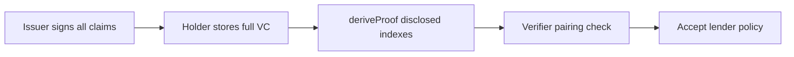

# BBS+ and VCDM 2.0

**Implementation:** [FTHTrading/Legacy](https://github.com/FTHTrading/Legacy) — **documentation only in ruby**

## Why BBS+

BBS+ signatures on BLS12-381 allow a holder to prove an issuer signed a set of claims while disclosing only a subset — ideal for lender desks that need lien status without receiving full laboratory report CIDs.

## VCDM 2.0

Gem assets use `GemAssetCredential` schema v1 with optional BBS+ proof suites. Context and samples live in Legacy:

- [gem-asset-v1-with-bbs.jsonld](https://github.com/FTHTrading/Legacy/blob/main/docs/vc-schemas/gem-asset-v1-with-bbs.jsonld)
- Open PRs: `feat/bbs-plus-gem-vc`, `feat/bbs-plus-real-crypto`, `docs/bbs-pairing-deep-dive`

## Curve family

BLS12-381 is a pairing-friendly curve family; polynomial parametrization and the tower parameter **u** are documented in Legacy:

- [BLS12_CURVE_FAMILY.md](https://github.com/FTHTrading/Legacy/blob/docs/bbs-pairing-deep-dive/docs/BLS12_CURVE_FAMILY.md) (on docs branch)
- [BLS12_381_CURVE.md](https://github.com/FTHTrading/Legacy/blob/docs/bbs-pairing-deep-dive/docs/BLS12_381_CURVE.md)

## Selective disclosure flow

## Ruby constraint

Do **not** duplicate BBSService or crypto here. Link to Legacy APIs and engineering docs for verification behavior.
