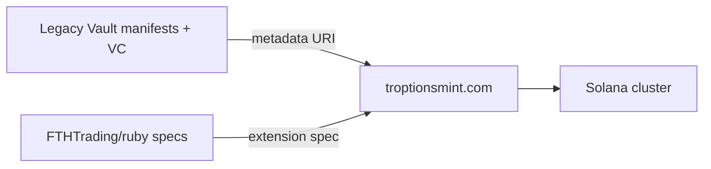

# troptionsmint.com — Architecture Alignment (Ruby RWA)

**Product:** Institutional Solana mint console at [troptionsmint.com](https://troptionsmint.com).

**Use case:** Mint Token-2022 RWA tokens for Allure Ruby / Siam Emerald with extensions documented in [docs/tokenization/](../docs/tokenization/).

This file records **documented** integration points only. It does not describe undocumented UI screens or features.

---

## Documented capabilities (external product)

| Capability | Ruby RWA usage |
|------------|----------------|
| Token-2022 mint | Enable Metadata Pointer, Default Frozen, Memo Required, Transfer Hook |
| Authority revocation | Revoke mint/freeze authority in same flow for immutable supply |
| Institutional operator workflow | Human/operator-driven mint; keys not stored in ruby repo |

---

## Extension configuration (operator checklist)

Reference: [TOKEN_2022_EXTENSIONS.md](../docs/tokenization/TOKEN_2022_EXTENSIONS.md)

| Step | Action |
|------|--------|
| 1 | Publish public metadata JSON (Legacy URIs) — [METADATA_SCHEMA_RWA.json](../docs/tokenization/METADATA_SCHEMA_RWA.json) |
| 2 | Set Metadata Pointer to metadata account / URI |
| 3 | Enable Default Account Frozen for distribution phase |
| 4 | Enable Required Memo on Transfer |
| 5 | Attach Transfer Hook: `TROPTIONS_TRANSFER_HOOK_PROGRAM_ID_TBD` |
| 6 | Devnet sandbox → mainnet after hook audit + legal clearance |
| 7 | Revoke authorities when supply final |

---

## Data flow

---

## Metadata binding

- **Source of truth for URIs:** Legacy-published JSON per [TOKEN_METADATA.md](https://github.com/FTHTrading/Legacy/blob/main/docs/ruby-rwa/TOKEN_METADATA.md).
- **No NAV** in metadata until independent appraisal and legal sign-off.
- **GMIIE** `gmiiOracleRef` optional — market comps only.

---

## Post-mint

| Task | Owner |
|------|-------|
| Record mint signature + metadata URI | ruby tracking / issues |
| Link `legacy_manifest_id`, `gem_vc_id` | Legacy + metadata |
| Enable transfer hook relayer | Brick #3 |
| x402 `token.transfer` indexing | See [X402_INTEGRATION_SPECIFICATION.md](../docs/x402/X402_INTEGRATION_SPECIFICATION.md) §4.5 |

---

## Related repositories

| Repo | Role |
|------|------|
| [FTHTrading/ruby](https://github.com/FTHTrading/ruby) | Planning + specs (this repo) |
| [FTHTrading/Legacy](https://github.com/FTHTrading/Legacy) | Vault, VC, BBS+, x402 web app |
| FTHTrading / solana-launcher | Supporting infra (separate) |

---

*Console behavior changes with product releases — verify against published troptionsmint documentation before mainnet.*
