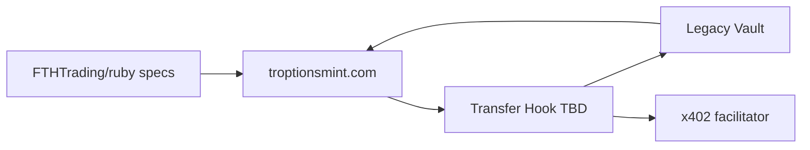

# Solana Token-2022 Extensions — Allure Ruby / Siam Emerald RWA

**Assets:** 54.00 ct Allure Ruby (GIA / Gübelin / GRS, heated East Africa) and complementary polished emerald (Siam market context). Optional copper SKR track documented separately in intake.

**Mint console:** [troptionsmint.com](https://troptionsmint.com) — institutional Solana mint with Token-2022 support and authority revocation (documented product capability; UI specifics follow published console behavior only).

**Provenance / compliance host:** [FTHTrading/Legacy](https://github.com/FTHTrading/Legacy) — encrypted vault, manifests, DID/VC, optional BBS+ selective disclosure.

**Valuation:** Independent appraisal **TBD**. No NAV or dollar package value in on-chain metadata or this spec.

---

## Extension catalog

| Extension | Token-2022 role | RWA use (Ruby / Emerald) | Priority |
|-----------|-----------------|--------------------------|----------|
| **Transfer Hook** | CPI to external program on every transfer | Compliance gate: accredited/KYC policy, optional Legacy BBS+ proof, x402 metering signal, Legacy Chain log anchor | **P0** |
| **Metadata Pointer** | On-mint pointer to metadata account | Immutable link to public RWA JSON (`METADATA_SCHEMA_RWA.json` pattern) | **P0** |
| **Default Account State (Frozen)** | New token accounts start frozen | Distribution control until SPV / policy thaw | **P0** |
| **Required Memo on Transfer** | Transfer must include memo instruction | Bind transfers to audit memo + x402 / policy correlation | **P0** |
| Mint Close Authority | Close mint when supply fixed | Post-mint immutability workflow via troptionsmint revocation flow | P1 |
| Permanent Delegate | Optional policy delegate | SPV-operated thaw / compliance overrides (governance-defined) | P2 |
| Transfer Fee | Fee on transfer | Not planned for Brick #1; revisit for secondary market rails | P3 |
| Interest-Bearing | N/A for gem RWA | Not used | — |

---

## Priority rationale (P0 quartet)

### 1. Transfer Hook

- Enforces **programmable transfer policy** before SPL transfer completes.
- Delegates rich checks to off-chain/Legacy (BBS+ presentation, manifest hash, lien flags) via spec in [TRANSFER_HOOK_SPEC.md](./TRANSFER_HOOK_SPEC.md).
- Program ID placeholder: `TROPTIONS_TRANSFER_HOOK_PROGRAM_ID_TBD`.

### 2. Metadata Pointer

- Keeps **on-chain footprint small**; full RWA disclosure lives in updatable-off-chain policy only where legally allowed (pointer target fixed at mint in typical troptionsmint flow).
- URIs reference Legacy manifest summaries and VC proof bundles — not encrypted cert bytes ([Legacy TOKEN_METADATA](https://github.com/FTHTrading/Legacy/blob/main/docs/ruby-rwa/TOKEN_METADATA.md)).

### 3. Default Account Frozen

- New holders receive **frozen ATAs** until SPV / compliance pipeline approves thaw.
- Pairs with troptionsmint mint workflow and private placement gates.

### 4. Required Memo on Transfer

- Every transfer carries a **structured memo** (JSON or compact key=value) for:
  - Policy version / transfer intent
  - Correlation to x402 `token.transfer` events (see [X402_INTEGRATION_SPECIFICATION.md](../x402/X402_INTEGRATION_SPECIFICATION.md) §4.5)
  - Optional Legacy audit id

---

## Phased rollout

| Phase | Extensions enabled | Exit criteria |
|-------|-------------------|---------------|
| **0 — Metadata & intake** | Metadata Pointer only (devnet) | Public metadata JSON published; Legacy `packageRef` + manifest stub; VC template aligned |
| **1 — Distribution lock** | + Default Frozen | Thaw SOP documented; SPV DID on metadata |
| **2 — Audit trail** | + Memo Required | Wallet integrations document memo format; indexers parse memos |
| **3 — Compliance hook** | + Transfer Hook (devnet → mainnet) | Hook spec implemented; Legacy `/api/vc/present/bbs` contract stable; x402 + chain log interfaces tested |
| **4 — Immutability** | Mint/freeze authority revoked via troptionsmint | Supply fixed; hook + metadata pointer immutable |

Phases may overlap in sandbox; **mainnet** requires Phase 3 hook audit and appraisal clearance for any NAV-adjacent off-chain docs.

---

## Stack integration

| Layer | Component | Responsibility |
|-------|-----------|----------------|
| **Planning** | FTHTrading/ruby (this repo) | Specs, phases, client PDFs, x402 event taxonomy |
| **Provenance** | FTHTrading/Legacy | Encrypt/upload certs, vault manifest, RWA manifest API, BBS+ VC |
| **Mint** | troptionsmint.com | Token-2022 mint, extension toggles per published console, authority revocation |
| **Hook** | `tokenization/transfer-hook/` (stub) | On-chain program TBD — see README |
| **Payments / audit** | x402 (Legacy + ruby spec) | Optional per-transfer metered proof; `token.transfer` events |
| **Chain log** | Legacy Layer 0 (`x402-hooks`, `audit-events`) | Anchor transfer compliance decisions (interface only Brick #1) |
| **Oracle (reference)** | GMIIE | `gmiiOracleRef` comps — **not** appraisal or NAV |
| **Identity** | SPV `did:web` | Issuer + metadata `spv_did` |

---

## troptionsmint.com notes

Documented capabilities (do not infer undocumented UI):

| Capability | RWA relevance |
|------------|---------------|
| Token-2022 mint | Enable Metadata Pointer, Default Frozen, Memo Required, Transfer Hook per operator checklist |
| Authority revocation | Single-transaction mint/freeze authority revoke for immutable supply |
| Institutional workflow | Operator-driven mint; ruby repo does not host mint keys |

**Operator checklist (engineering):**

1. Confirm extension set matches [phased rollout](#phased-rollout) for target cluster (devnet vs mainnet).
2. Bind metadata URI from Legacy-published JSON (sample: [METADATA_SCHEMA_RWA.json](./METADATA_SCHEMA_RWA.json)).
3. Set Transfer Hook program id to `TROPTIONS_TRANSFER_HOOK_PROGRAM_ID_TBD` until deployment.
4. Record mint tx + metadata URI in ruby tracking issues; link Legacy `manifestId` / `contentHash`.
5. Do not enter appraisal dollar amounts in metadata until legal clearance.

---

## Related specifications

- [TRANSFER_HOOK_SPEC.md](./TRANSFER_HOOK_SPEC.md)
- [METADATA_SCHEMA_RWA.json](./METADATA_SCHEMA_RWA.json)
- [architecture/troptionsmint.md](../../architecture/troptionsmint.md)
- Legacy: [TOKEN_2022_INTEGRATION.md](https://github.com/FTHTrading/Legacy/blob/main/docs/ruby-rwa/TOKEN_2022_INTEGRATION.md)

---

*Engineering alignment only — not an offer, securities opinion, or appraisal.*
