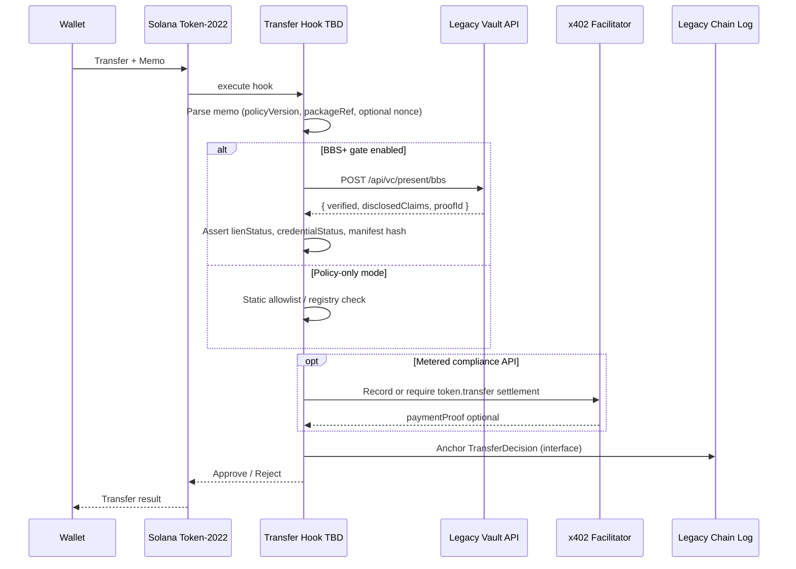

# Transfer Hook Program — Draft Specification (RWA)

**Status:** Draft / interfaces only  
**Program ID:** `TROPTIONS_TRANSFER_HOOK_PROGRAM_ID_TBD`  
**Assets:** Allure Ruby + Siam Emerald RWA tokens minted via troptionsmint.com Token-2022

This document defines the **intended** on-chain hook behavior and off-chain integration surfaces. It does not ship a full Solana program in this repository (see [tokenization/transfer-hook/README.md](../../tokenization/transfer-hook/README.md)).

---

## Goals

1. Reject transfers that fail compliance policy (accreditation, lien, credential status).
2. Optionally require a **BBS+ selective disclosure proof** from Legacy Vault (`POST /api/vc/present/bbs`).
3. Emit or correlate **x402** payment / audit events for metered compliance checks.
4. **Anchor** a compact decision record to Legacy Chain / Layer 0 audit interfaces (no full chain implementation here).

---

## Hook invocation (Token-2022)

On `Transfer` / `TransferChecked`, the Token-2022 program CPIs to the Transfer Hook program with:

| Input (conceptual) | Source |
|--------------------|--------|
| Source token account | Transaction |
| Destination token account | Transaction |
| Mint | RWA mint |
| Amount | Instruction data |
| Memo (if Required Memo extension) | SPL Memo program |
| Extra account metas | Hook interface (oracle, registry, etc.) |

**Return:** `Approve` or `Reject` (custom error codes for observability).

---

## Compliance check flow



### Decision inputs

| Check | Source | Fail closed? |
|-------|--------|--------------|
| Memo present & schema valid | On-chain memo | Yes |
| `packageRef` matches mint metadata | Metadata JSON | Yes |
| `lienStatus` in allowed set | BBS+ disclosed claim or registry | Yes |
| `credentialStatus === ISSUED` | BBS+ or Legacy provenance API | Yes if BBS enabled |
| Manifest hash match | Legacy manifest URI vs claim | Yes |
| Appraisal / NAV | — | **Never** asserted in hook; appraisalRef optional future |

---

## Legacy Vault BBS+ optional gate

**Endpoint (planned contract):** `POST /api/vc/present/bbs`

| Field | Type | Description |
|-------|------|-------------|
| `verifierChallenge` | string? | Fiat-Shamir challenge from hook or relayer |
| `presentation` | object | BBS+ selective disclosure proof (VCDM 2.0) |
| `requiredDisclosures` | string[] | e.g. `lienStatus`, `legacyVaultManifestCid`, `spvDid` |
| `mint` | string | Solana mint pubkey (base58) |
| `transferIntent` | string | e.g. `secondary`, `custody`, `collateral` |

**Response (conceptual):**

```json
{
  "verified": true,
  "proofId": "urn:uuid:sample-proof-id",
  "disclosedClaims": {
    "lienStatus": "CLEAR",
    "legacyVaultManifestCid": "bafySAMPLEmanifest",
    "spvDid": "did:web:spv.example.com"
  },
  "manifestUri": "https://legacy.example/api/rwa/manifest/sample"
}
```

Implementation reference: `lib/vc/bbs/BBSService.ts` in Legacy (Brick #2). Hook may call via **off-chain relayer** or **verified oracle attestation** in production — interface choice is deployment-specific.

---

## x402 event emit (interface)

When compliance checks are metered, the hook relayer records an x402-aligned event (see ruby [X402_INTEGRATION_SPECIFICATION.md](../x402/X402_INTEGRATION_SPECIFICATION.md) §4.5).

| Event type | When |
|------------|------|
| `token.transfer` | Transfer attempted (memo includes correlation id) |
| `token.transfer.compliance_check` | Legacy BBS+ or policy API invoked |
| `token.transfer.denied` | Hook rejected transfer |

**Payment:** Optional `X-Payment` proof for `API_METERED_CALL` or dedicated `TOKEN_TRANSFER_COMPLIANCE` service id (TBD catalog alignment with Legacy `lib/x402/index.ts`).

---

## Legacy Chain log anchor (interface only)

No new chain code in ruby repo. Intended anchor payload for Layer 0 `audit-events` / `x402-hooks`:

```json
{
  "eventType": "TransferDecision",
  "mint": "<base58-mint>",
  "signature": "<tx-signature-if-approved>",
  "decision": "APPROVED | REJECTED",
  "reasonCode": "POLICY_001",
  "manifestHash": "<sha256-hex>",
  "proofId": "urn:uuid:optional",
  "timestamp": "ISO-8601"
}
```

Relayer publishes after hook execution; Solana program does **not** block on chain log confirmation in Brick #1.

---

## Error codes (draft)

| Code | Meaning |
|------|---------|
| `HOOK_001` | Missing required memo |
| `HOOK_002` | Invalid memo JSON |
| `HOOK_003` | BBS+ verification failed |
| `HOOK_004` | Lien not clear |
| `HOOK_005` | Manifest hash mismatch |
| `HOOK_006` | Credential not issued |
| `HOOK_007` | x402 payment required but absent |
| `HOOK_099` | Policy registry unreachable (fail closed in production) |

---

## Security notes

- Hook program must be **immutable** after mainnet deploy (upgrade authority disabled or multisig).
- Relayer keys are hot — minimize trust via BBS+ verification on Legacy, not relayer assertions alone.
- Encrypted cert CIDs never appear in hook logs; only hashes and proof ids.

---

## See also

- [TOKEN_2022_EXTENSIONS.md](./TOKEN_2022_EXTENSIONS.md)
- Legacy: [TOKEN_2022_INTEGRATION.md](https://github.com/FTHTrading/Legacy/blob/main/docs/ruby-rwa/TOKEN_2022_INTEGRATION.md)
- [tokenization/transfer-hook/README.md](../../tokenization/transfer-hook/README.md)
