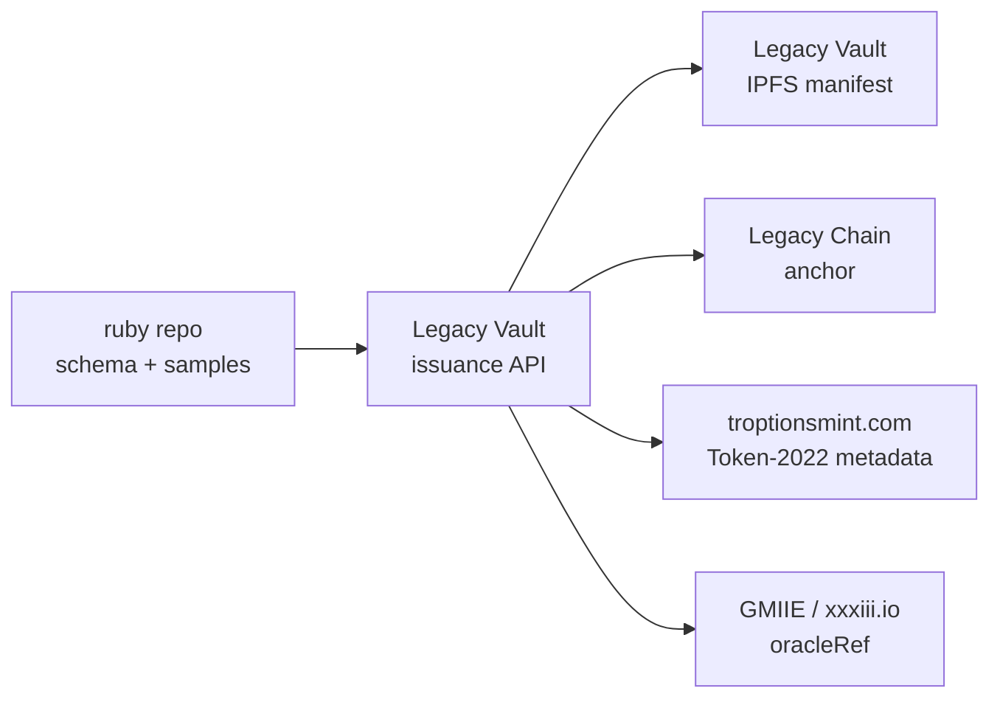

# Gem Asset Verifiable Credential Schemas (v1)

VCDM 2.0 `GemAssetCredential` for the **Allure Ruby + emerald bundle** RWA program.

> **Canonical schema** is maintained in both [FTHTrading/ruby](https://github.com/FTHTrading/ruby) (this repo) and [FTHTrading/Legacy](https://github.com/FTHTrading/Legacy). **Issuance happens only via Legacy Vault Protocol** — this repo holds documentation, JSON-LD definitions, and unsigned samples.

## Files

| File | Purpose |
|------|---------|
| [`gem-asset-v1.jsonld`](./gem-asset-v1.jsonld) | Full JSON-LD + `credentialSubject` property definitions |
| [`gem-v1-context.jsonld`](./gem-v1-context.jsonld) | Vocabulary stub for `https://schema.fthtrading.com/gem/v1` |
| [`examples/allure-ruby-sample-vc.json`](./examples/allure-ruby-sample-vc.json) | Unsigned synthetic VC (redacted certs, SAMPLE CIDs) |
| [`examples/lender-minimal-presentation.json`](./examples/lender-minimal-presentation.json) | SD-JWT `collateral_lending` presentation shape |

## Ecosystem integration



| Integration | VC claim | System |
|-------------|----------|--------|
| Custody & certs | `vaultRef`, `manifestCID` | Legacy Vault Protocol |
| Immutable registry | `chainAnchorRef` | Legacy Chain |
| On-chain RWA | `linkedRWATokens`, `troptionsmintMetadata` | troptionsmint.com (Solana Token-2022) |
| NAV / risk feeds | `oracleRef` | GMIIE (xxxiii.io) |

## Selective disclosure

| Group | Audience | Mechanism |
|-------|----------|-----------|
| `collateral_lending` | Lenders / collateral desks | SD-JWT (primary) |
| `secondary_market` | Marketplace counterparties | SD-JWT |
| `regulatory_full` | Regulators / accredited investors | SD-JWT (full claims) |
| `guardian_internal` | Legacy guardian quorum | BBS+ (high privacy) |

See [`gem-asset-v1.jsonld`](./gem-asset-v1.jsonld) `selectiveDisclosure` block for claim paths.

## Valuation policy

The `valuation.amount` field is **intentionally null** in samples. This repository does **not** assert package NAV (e.g. no `$600M` figure in machine-readable claims). Populate only after an independent third-party appraisal with `appraisalStatus: completed`.

## Issuance (Legacy only)

```
POST https://<legacy-host>/api/vc/issue/gem-asset
```

Returns `501 Not Implemented` in production until HSM signing is wired; dev mock available when `GEM_VC_ISSUANCE_MOCK=true`.

Human-readable operator doc: [Legacy `docs/ruby-rwa/GEM_ASSET_VC_SCHEMA.md`](https://github.com/FTHTrading/Legacy/blob/main/docs/ruby-rwa/GEM_ASSET_VC_SCHEMA.md)

## License

MIT (this repo). Legacy issuance stack remains proprietary.
