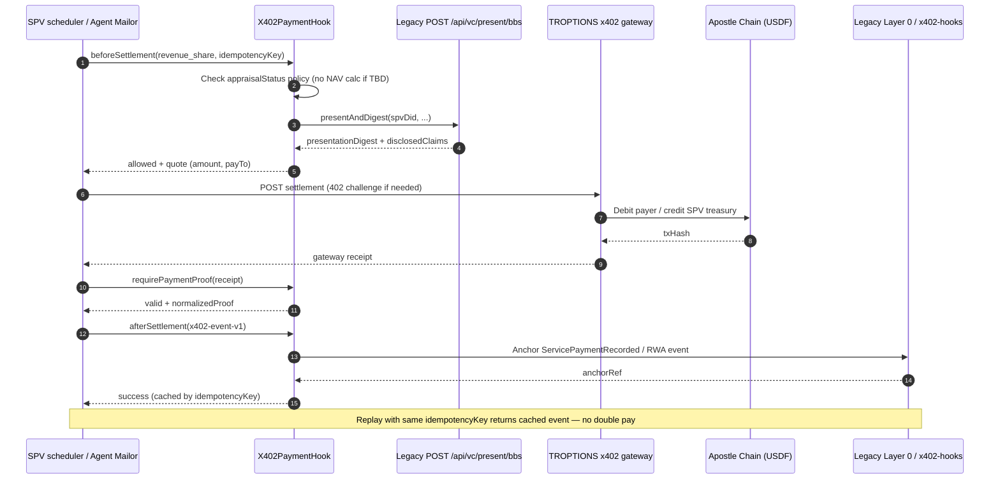
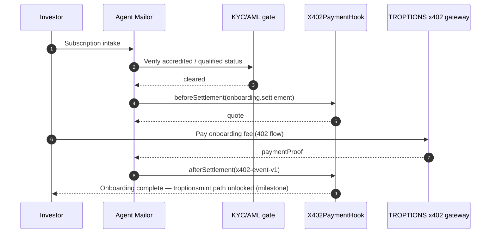

# x402 Sequence Flows — Allure Ruby RWA

**Version:** 1.0 | **Date:** June 4, 2026

Mermaid sequence diagrams for primary RWA x402 flows. Settlement rails shown as **TROPTIONS x402 gateway → Apostle Chain USDF**; Solana transfer-hook path is milestone-dependent.

> **Valuation:** Revenue-share amounts must not use asserted NAV. Until independent appraisal is `completed`, use configured flat fees or counsel-approved schedules only.

---

## Revenue share distribution



---

## Collateral management (pledge and release)

```mermaid
sequenceDiagram
  autonumber
  participant Lender as Lender / collateral desk
  participant AM as Agent Mailor
  participant BBS as Legacy POST /api/vc/present/bbs
  participant Hook as X402PaymentHook
  participant GW as TROPTIONS x402 gateway
  participant RE as Release engine (Legacy)

  Lender->>AM: Collateral workflow request
  AM->>BBS: disclosedClaims titleStatus, valuation.appraisalStatus
  BBS-->>AM: BBS+ presentation (appraisalStatus TBD — no NAV disclosed)
  AM->>Hook: beforeSettlement(collateral.pledge, presentationDigest)

  alt appraisalStatus is TBD
    Hook-->>AM: allowed for fee-only pledge; LTV binding blocked
  else appraisalStatus completed
    Hook-->>AM: allowed per counsel LTV policy
  end

  AM->>GW: Pay collateral fee / escrow (USDF)
  GW-->>AM: paymentProof
  AM->>Hook: afterSettlement(x402-event-v1)
  Hook-->>AM: anchored

  Note over Lender,RE: Release path requires additional claims (lienStatus)

  Lender->>AM: Release request
  AM->>BBS: titleStatus, lienStatus, valuation.appraisalStatus
  BBS-->>AM: release presentation
  AM->>RE: Multi-proof release check
  RE-->>AM: release authorized
  AM->>Hook: beforeSettlement(collateral.release, ...)
  AM->>GW: Settlement / fee
  GW-->>AM: paymentProof
  AM->>Hook: afterSettlement(x402-event-v1)
  Hook-->>Lender: Collateral release recorded
```

---

## Onboarding settlement (simplified)



---

## Related

- [X402_INTEGRATION_SPECIFICATION.md](./X402_INTEGRATION_SPECIFICATION.md)
- [PAYMENT_HOOK_INTERFACE.md](./PAYMENT_HOOK_INTERFACE.md)
- [FTHTrading/Legacy BBS+ integration](https://github.com/FTHTrading/Legacy/blob/main/docs/BBS_PLUS_INTEGRATION.md)
