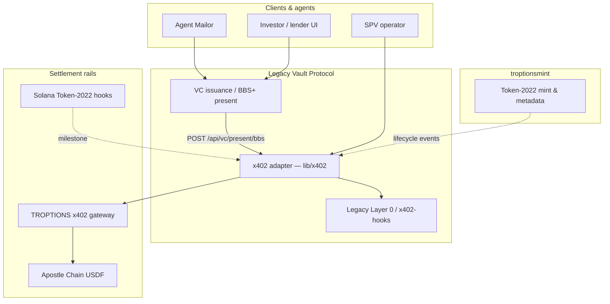

# x402 Payment Protocol Integration Specification

**Version:** 1.0  
**Date:** June 4, 2026  
**Status:** Draft — Troptions-internal protocol  
**Repositories:** [FTHTrading/ruby](https://github.com/FTHTrading/ruby) (canonical spec), [FTHTrading/Legacy](https://github.com/FTHTrading/Legacy) (implementation surface)

---

## 1. Purpose and scope

This document defines how **x402** — the Troptions ecosystem's programmable Web3 settlement rail — integrates with the **Allure Ruby & Siam Emerald** real-world asset (RWA) program and adjacent Troptions infrastructure (Legacy Vault, troptionsmint, Agent Mailor, GMIIE).

**In scope:**

- Event taxonomy for RWA lifecycle payments (onboarding, revenue share, collateral management).
- JSON event schema (`x402-event-v1`) and payment-hook contracts.
- Selective-disclosure prerequisites for sensitive payment flows.
- Idempotency, settlement verification, and operational modes.

**Out of scope:**

- Claiming ISO, ERC, or W3C standard status for x402 (this is a **Troptions-internal protocol**).
- Real mint addresses, operator wallet keys, or production gateway URLs in this repository.
- Binding valuation — package economics remain **target package subject to independent appraisal (TBD)**; no NAV is asserted herein.

**Audience:** engineering, product, counsel (non-binding technical reference), and institutional counterparties reviewing stack capability.

---

## 2. Protocol identity and non-claims

| Attribute | Statement |
|-----------|-----------|
| **Name** | x402 (Troptions x402) |
| **Inspiration** | HTTP `402 Payment Required` semantics for machine-payable services |
| **Governance** | FTHTrading / Troptions ecosystem; versioned in this repo |
| **Standard status** | **Not** an ISO standard, **not** an ERC, **not** a W3C recommendation |
| **Settlement rails** | Configurable per deployment: Apostle Chain USDF, Troptions gateway metering, Solana Token-2022 transfer hooks (milestone-dependent) |

x402 functions as a **settlement and metering fabric** connecting programmatic payment proofs to asset lifecycle events. Availability of specific event types and rails is **milestone-dependent** and must be enumerated in definitive agreements.

---

## 3. Ecosystem context — Allure Ruby RWA

The Allure program tokenizes a **54.00 ct heated ruby** (multi-laboratory certification) with a **complementary polished emerald** (Siam / global trading-hub context) as a coordinated RWA package.

| Component | Role relative to x402 |
|-----------|------------------------|
| **Legacy Vault + Legacy Chain** | Anchors SPV events, VC digests, audit; hosts BBS+ presentation API consumed before sensitive payments |
| **troptionsmint.com** | Solana Token-2022 mint; transfer hooks may gate compliant transfers; metadata stays summary-level until appraisal |
| **GemAssetCredential (VCDM 2.0)** | Issuance via Legacy only; `valuation.amount` null until independent appraisal `completed` |
| **Agent Mailor** | Client-operations orchestration; may initiate x402 settlement requests after KYC gates |
| **GMIIE / xxxiii.io** | Market intelligence references — **does not replace independent appraisal** |
| **x402** | Programmable settlement for configured lifecycle events (distributions, collateral flows, onboarding fees) |

**Valuation policy (mandatory language):**  
**Target package value is subject to independent third-party appraisal (TBD).** Any order-of-magnitude planning figure (e.g. internal ~$600M references) is **not** asserted NAV and is superseded by completed appraisal accepted by governance.

---

## 4. Architecture overview



**Integration principles:**

1. **Separate private provenance from public issuance** — sensitive claims stay in Legacy Vault; x402 events carry references (DIDs, manifest hashes), not unredacted certificates.
2. **Pay-before-sensitive-action** — collateral releases, high-value distributions, and certain onboarding settlements require prior BBS+ presentation verification (see §7).
3. **Idempotent settlement** — every monetary event carries an `idempotencyKey`; replays must not double-settle.
4. **Mode-aware deployment** — `LOCAL_ADAPTER`, `X402_READY`, `PRODUCTION_REQUIRES_GATEWAY` (see Legacy `lib/x402/index.ts`).

---

## 5. Event schema — `x402-event-v1`

All RWA lifecycle settlements serialized for audit, gateway ingestion, and Layer 0 anchoring **must** conform to `x402-event-v1`.

Canonical JSON Schema: [`schemas/x402-event-v1.json`](./schemas/x402-event-v1.json).

### 5.1 Event types (RWA profile)

| `eventType` | Description | Typical trigger |
|-------------|-------------|-----------------|
| `rwa.onboarding.settlement` | Investor onboarding fee or subscription settlement | Agent Mailor intake complete |
| `rwa.revenue_share.distribution` | Configured revenue share to token holders / SPV beneficiaries | Counsel-approved schedule |
| `rwa.collateral.pledge` | Collateralization payment or fee tied to lending workflow | Lender acceptance + VC proof |
| `rwa.collateral.release` | Release of collateral hold or lien-related settlement | Multi-proof release engine |
| `rwa.spv.fee` | SPV operational fee (custody, platform, appraisal pass-through) | Operator invoice |
| `rwa.lifecycle.anchor` | Non-monetary anchor companion (amount zero) linking on-chain anchor to payment batch | Legacy Chain anchor |

### 5.2 Required fields (summary)

| Field | Type | Notes |
|-------|------|-------|
| `schemaVersion` | `"x402-event-v1"` | Constant |
| `eventId` | UUID | Unique event identifier |
| `idempotencyKey` | string | Stable across retries; see §8 |
| `eventType` | enum | One of §5.1 |
| `packageRef` | string | RWA package identifier (e.g. `allure-ruby-emerald-v1`) |
| `spvDid` | string | SPV DID when assigned |
| `amount` | string (decimal) | `"0"` for anchor-only events |
| `currency` | string | e.g. `USDF`, `USD` (off-chain invoice), `SOL` (milestone) |
| `settlementRail` | enum | `apostle_chain`, `troptions_gateway`, `solana_transfer_hook`, `local_adapter` |
| `paymentProof` | object | Rail-specific proof reference (tx hash, gateway receipt) |
| `occurredAt` | ISO 8601 | Event timestamp |
| `metadata` | object | Extensible; must not contain unredacted PII or asserted NAV |

### 5.3 Prohibited metadata

- Raw laboratory report content or certificate PDF CIDs intended for private vault only.
- Asserted `valuation.amount` or marketing-scale NAV integers.
- Production mint addresses or operator secrets.

---

## 6. Payment hooks

Payment hooks are **TypeScript-implementable contracts** (reference definitions in [`PAYMENT_HOOK_INTERFACE.md`](./PAYMENT_HOOK_INTERFACE.md)) invoked by Legacy adapter, Agent Mailor, or troptionsmint orchestration.

| Hook | Responsibility |
|------|----------------|
| `beforeSettlement` | Validate KYC gate, event type enabled for package, idempotency freshness |
| `requirePaymentProof` | HTTP 402 challenge/response or pre-shared gateway receipt |
| `afterSettlement` | Emit `x402-event-v1`, anchor on Legacy Layer 0, notify Agent Mailor |
| `onSettlementFailure` | Dead-letter with retry policy; no partial VC state updates |

Hooks are **composable**: a revenue-share run may chain `beforeSettlement` → gateway debit → `afterSettlement` → optional Token-2022 metadata update (no NAV fields).

---

## 7. Selective disclosure gate (BBS+)

Sensitive x402 flows **must** verify a BBS+ selective disclosure presentation before executing payment:

```
POST /api/vc/present/bbs   (Legacy Vault)
```

**Minimum disclosed claims by flow:**

| Flow | Required disclosed claims (illustrative) |
|------|----------------------------------------|
| `rwa.collateral.pledge` | `titleStatus`, `valuation.appraisalStatus` |
| `rwa.collateral.release` | `titleStatus`, `lienStatus`, `valuation.appraisalStatus` |
| `rwa.revenue_share.distribution` | `spvDid`, governance attestation claim (per counsel schema) |

`valuation.appraisalStatus: "TBD"` proves issuer-signed policy state — **not** an appraised dollar NAV. Binding LTV requires completed independent appraisal.

Implementation: [`PAYMENT_HOOK_INTERFACE.md`](./PAYMENT_HOOK_INTERFACE.md) — `X402SelectiveDisclosureHook`.

---

## 8. Idempotency and settlement

### 8.1 Idempotency key format

```
x402:{packageRef}:{eventType}:{businessKey}:{version}
```

- `businessKey` — e.g. `distribution-2026-Q2`, `collateral-pledge-{lenderDid}`, `onboarding-{investorDid}`.
- `version` — increment only when business intent changes (not on network retry).

### 8.2 Settlement verification

| Rail | Verification |
|------|--------------|
| `apostle_chain` | Receipt lookup; amount ≥ quoted; recipient matches service address; tx not previously consumed |
| `troptions_gateway` | Gateway receipt JWT or hash; OpenMeter correlation id when enabled |
| `solana_transfer_hook` | Program log + signature (milestone); program id **stub only** in docs |
| `local_adapter` | Always succeeds; records mock proof for dev |

**Replay policy:** Same `idempotencyKey` + valid prior proof → return cached success (HTTP 200) without re-charging.

Sequence diagrams: [`SEQUENCE_FLOWS.md`](./SEQUENCE_FLOWS.md).

---

## 9. Security, compliance, and valuation policy

### 9.1 Security

- No secrets in git; use environment configuration per [`Legacy OPERATOR_RUNBOOK`](https://github.com/FTHTrading/Legacy/blob/main/docs/OPERATOR_RUNBOOK.md).
- Payment proofs are single-use where the rail supports consumption tracking.
- Operator console (`/admin/x402`) is authenticated; namespace-scoped quotas.

### 9.2 Compliance

- x402 does not substitute for securities law analysis, KYC/AML, or accredited-investor verification.
- Agent Mailor coordinates workflows; licensed compliance officers remain accountable.
- Event logs support audit export (metered via x402 in Legacy).

### 9.3 Valuation policy (repeated)

**Target package subject to independent appraisal (TBD).** Revenue-share calculations that depend on NAV **must not** execute until `valuation.appraisalStatus` is `completed` and counsel approves the calculation basis. Until then, distributions remain configuration-only or flat-fee based as defined in definitive agreements.

---

## 10. Milestones and open questions

| Milestone | Deliverable | Status |
|-----------|-------------|--------|
| M1 | Canonical spec + JSON Schema (this document) | **Complete (v1.0 draft)** |
| M2 | Legacy `docs/ruby-rwa/x402/INTEGRATION.md` summary | In progress |
| M3 | Solana transfer-hook program id **stub** + interface alignment | **Open** — see recommendation |
| M4 | Cloudflare Worker gateway binding for production | **Open** |
| M5 | Revenue-share pilot on `LOCAL_ADAPTER` | Planned |
| M6 | Collateral pledge E2E with BBS+ gate | Planned |

### Open questions

1. **Solana program ID stub vs Worker implementation** — see [`docs/x402/README.md`](./README.md#recommended-next-steps).
2. Revenue-share denominator: token supply vs SPV unit class — counsel TBD.
3. Cross-chain fee currency: USDF-only vs multi-stablecoin — operator configuration TBD.

---

## References

| Document | Location |
|----------|----------|
| Payment hook interfaces | [`PAYMENT_HOOK_INTERFACE.md`](./PAYMENT_HOOK_INTERFACE.md) |
| Sequence flows | [`SEQUENCE_FLOWS.md`](./SEQUENCE_FLOWS.md) |
| Event JSON Schema | [`schemas/x402-event-v1.json`](./schemas/x402-event-v1.json) |
| Legacy x402 adapter | [FTHTrading/Legacy `lib/x402/index.ts`](https://github.com/FTHTrading/Legacy/blob/main/lib/x402/index.ts) |
| Legacy integration summary | [FTHTrading/Legacy `docs/ruby-rwa/x402/INTEGRATION.md`](https://github.com/FTHTrading/Legacy/blob/main/docs/ruby-rwa/x402/INTEGRATION.md) |
| BBS+ presentation API | [FTHTrading/Legacy `docs/BBS_PLUS_INTEGRATION.md`](https://github.com/FTHTrading/Legacy/blob/main/docs/BBS_PLUS_INTEGRATION.md) |
| Client-facing term sheet (x402 §9) | [`../client-facing/TERM_SHEET_LANGUAGE.md`](../client-facing/TERM_SHEET_LANGUAGE.md) |

---

*© FTHTrading — Troptions-internal documentation. MIT License applies to documentation in the ruby repository.*
